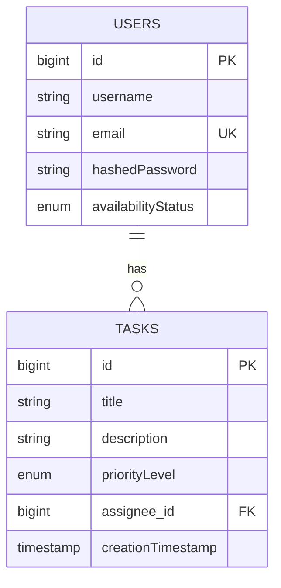

# Task Management Web App (Labs 1–3)

Monorepo: Spring Boot backend + React frontend.

## ER (Mermaid)

## Quick Start
### Backend
1) Создай БД: `CREATE DATABASE taskdb;`
2) Пропиши доступы в `backend/src/main/resources/application.properties`.
3) Запуск: `cd backend && mvn spring-boot:run`
4) Health: `GET http://localhost:8080/actuator/health`

### Frontend
1) `cd frontend && npm install`
2) `npm start` → http://localhost:3000

### Login
`alice@example.com` / `password`

### API (основное)
- POST `/api/auth/login`
- GET `/api/tasks` (`?priority=HIGH`, `?assigneeId=1`)
- POST `/api/tasks`
- PUT `/api/tasks/{id}`
- DELETE `/api/tasks/{id}`
- PATCH `/api/tasks/{id}/completed`
- POST `/api/tasks/assign`

### Tests
- Backend: `cd backend && mvn test`
- Frontend: `cd frontend && npm test`
